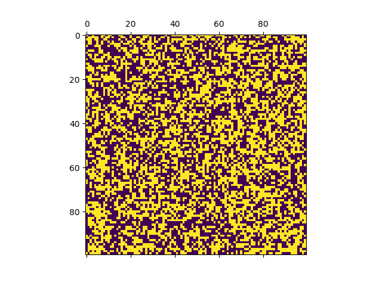
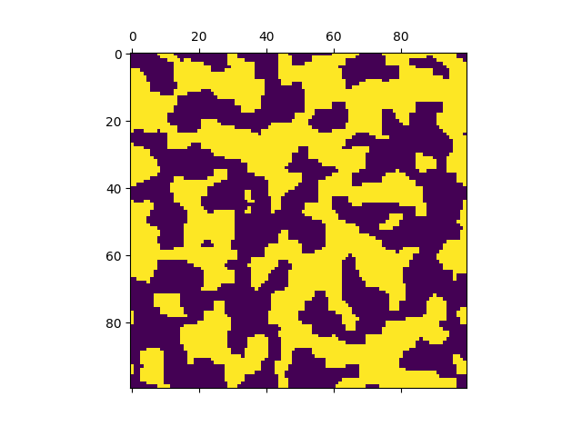
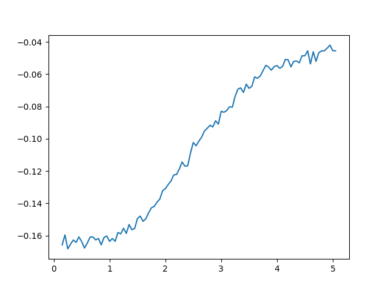

# Ising model

Calculate internal energy of Ising model using Metropolis Monte-Carlo algorithm.

## Installation

    pip3 install -r requirements.txt
    python3 main.py

## Usage:

    Plotter(iterations_number=100000,
		    lattice_size=100,
		    sum_threshold=0,
		    t_0=0.1, t_1=5,
		    step=0.05,
		    draw_spins=False).run()

1) `iterations_number` - number of Monte-Carlo throws

2) `lattice_size` - linear size of lattice

3) `sum_threshold` - iteration used to start averaging

4) `t_0, t_1` - boundaries for plotting

5) `step` - temperature step

6) `draw_spins` - display spins state during calculation

## Plots

